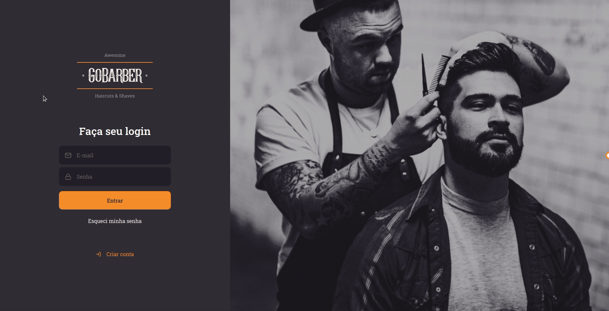

<h1 align="center">
      
      
    Node JS | ReactJS | React Native
</h1>

  <a href="#question-about">About</a>&nbsp;&nbsp;&nbsp;|&nbsp;&nbsp;&nbsp;
  <a href="#gear-features">Features</a>&nbsp;&nbsp;&nbsp;|&nbsp;&nbsp;&nbsp;
  <a href="#rocket-getting-started">Getting Started</a>&nbsp;&nbsp;&nbsp;|&nbsp;&nbsp;&nbsp;
  <a href="#memo-license">License</a>

 

## Create Appointment:

    

## List Appointments / Profile:

---

  

## :question: About

An application to connect barbers with their customers through appointments. This application has the following features: user authentication and creation, password reset, changing your user data, appointments creating, list your appointments...

The app was built during the "Bootcamp GoStack | RocketSeat ".

## :gear: Features
 
⌨️ <strong>Typescript</strong> —> Extends JavaScript by adding types;  
⚙️ <strong>NodeJS</strong> —> A platform for building network applications; 
🌐 <strong>Express</strong> —> Web framework for Node.js 
📚 <strong>Typeorm</strong> —> Used to manage databases; 
📚 <strong>PostgreSQL</strong> —> Used to store users and schedules; 
📚 <strong>Redis</strong> —> Used to store cache; 
📚 <strong>MongoDB</strong> —> Used to store notifications; 
🌐 <strong>JSON Web Token</strong> —> Used to manage the tokens (Example: authentication); 
✉️ <strong>Nodemailer</strong> —> Used to email sending 
🔧 <strong>Jest</strong> —> Used to test the application; 
⚛️ <strong>ReactJS</strong> —> A JavaScript library for building user interfaces; 
✅ <strong>Yup</strong> —> Used to validation of input fields; 
💅 <strong>Styled-components</strong> —> Tagged template literals to style the components; 
✅ <strong>Unform</strong> —> Used to create forms; 
⚙️ <strong>Nodemailer</strong> —> Used to email sending 
⚛️ <strong>React Native</strong> —> A framework for building native apps using React; 
🌐 <strong>Axios</strong> —> Promise based HTTP client for the browser and Node JS; 

 

## :rocket: Getting Started
1. Clone this repo: `git clone https://github.com/erickivel/GoBarber.git`
2. Move to the directory: `cd GoBarber`

### Server
1. Move to the server directory: `cd server`
2. Run `yarn` to install the dependencies
3. Run `yarn dev:server` to start the server

### Web
1. Move to the web directory: `cd web`
2. Run `yarn` to install the dependencies
3. Run `yarn start` to start the web application

### Mobile
1. Move to the mobile directory: `cd appgobarber`
2. Run `yarn` to install the dependencies
3. Run `yarn start` to start the expo
4. Open your mobile emulator
5. On the Expo page (open in the browser), click to run on your emulator (ios/android)

## :memo: License

This project is licensed under the **MIT License** - see the [LICENSE](LICENSE) file for details.